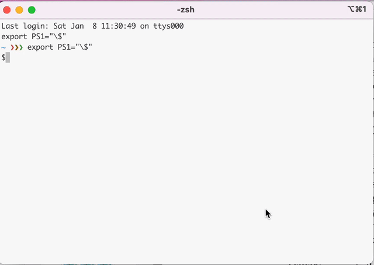

# OmniEdge app release

**Notice**: 
By using this server to install OmniEdge, you acknowledge that you have read and accepted [OmniEdge's TOS](https://omniedge.io/terms).

Packages are available for the following operating systems:

| Operating Systems  | OS Distribution |
| :---    | :---:   |
| Amazon Linux | [Amazon Linux 2](#-Amazon-Linux-2)  |
| CentOS  | [CentOS 7](#-CentOS-7)  \| [CentOS 8](#-CentOS-8) |
|Debian|[Debian Stretch](#-Debian-Stretch)  \| [Debian Buster](#-Debian-Buster)|
|Fedora|[Fedora](#-Fedora)|
|Raspbian|[Raspbian Buster (for Raspberry Pi)](#-Raspbian-Buster)|
|Ubuntu|[Ubuntu 16.04 LTS (Xenial)](#-Ubuntu-16.04-LTS-(Xenial)) \| [Ubuntu 18.04 LTS (Bionic)](#-Ubuntu-18.04-LTS-(Bionic)) \| [Ubuntu 19.10 (Eoan)](#-Ubuntu-19.10-(Eoan))  \| [Ubuntu 20.04 LTS (Focal)](#-Ubuntu-20.04-LTS-(Focal))  \| [Ubuntu 20.10 (Groovy)](#-Ubuntu-20.10-(Groovy))  \| [Ubuntu 21.04 (Hirsute)](#-Ubuntu-21.04-(Hirsute)) \| [Ubuntu 21.10 (Impish)](#-Ubuntu-21.10-(Impish))|
|Windows |Windows 7 \| Windows 10|

# Installation

Reference: [https://www.omniedge.io/docs/article/Install](https://www.omniedge.io/docs/article/Install)

## 1. Get Started

+ Sign up your account: [Sign up](https://omniedge.io/register)
+ Download OmniEdge with the link: [Download OmniEdge](https://omniedge.io/download)

## 2. Installing on Windows
OmniEdge Windows is compatible with Windows 7,10(arm) & Windows Server 2016,2019. `Last update: Version 0.2.0, January 15,2022.`

[Download OmniEdge Windows for 7 or later](windows/omniedge-setup-0.2.0.exe)

+ Download and run the Windows installer

+ Click on "Log in…" from the Omniedge icon now in your system tray

+ Sign in with your email address

+ Click "Connect" in the menu bar from the tray icon. After a pop-up disappears, a secure VPN connection is initialized.

## 3. Installing on MacOS

OmniEdge MacOS Cli is compatible with intel Macbook, macOS 10 or later Last update: Version 0.2.0, January 15, 2022.

*To use OmniEdge on MacOS, please instal Tun/Tap Driver first*

### 3.1 Install Tun/Tap Driver:

#### For Intel Mac: 

  - Download tuntap driver from [https://sourceforge.net/projects/tuntaposx/files/latest/download](https://sourceforge.net/projects/tuntaposx/files/latest/download) 
  - Extract `tuntap_20150118.tar.gz` and Install tuntap by running **tuntap_20150118.pkg**

#### For M1 Mac user: 

  - Download `https://github.com/Tunnelblick/Tunnelblick/tree/master/third_party/tap-notarized.kext`
  - Download `https://github.com/Tunnelblick/Tunnelblick/tree/master/third_party/tun-notarized.kext`
  - Change the name to **tap.kext** and **tap.kext**, 
  - Copy to **/Library/Extensions**
  - add `net.tunnelblick.tap.plist` and `net.tunnelblick.tun.plist` to `/Library/LaunchDaemons/`

  ```bash
    #net.tunnelblick.tap.plist
    <?xml version="1.0" encoding="UTF-8"?>
    <!DOCTYPE plist PUBLIC "-//Apple//DTD PLIST 1.0//EN" "http://www.apple.com/DTDs/PropertyList-1.0.dtd">
    <plist version="1.0">
    <dict>
        <key>Label</key>
        <string>net.tunnelblick.tap</string>
        <key>ProgramArguments</key>
        <array>
            <string>/sbin/kextload</string>
            <string>/Library/Extensions/tap.kext</string>
        </array>
        <key>KeepAlive</key>
        <false/>
        <key>RunAtLoad</key>
        <true/>
        <key>UserName</key>
        <string>root</string>
    </dict>
    </plist>

  ```

  ```bash
    #net.tunnelblick.tun.plist
    <?xml version="1.0" encoding="UTF-8"?>
    <!DOCTYPE plist PUBLIC "-//Apple//DTD PLIST 1.0//EN" "http://www.apple.com/DTDs/PropertyList-1.0.dtd">
    <plist version="1.0">
    <dict>
        <key>Label</key>
        <string>net.tunnelblick.tun</string>
        <key>ProgramArguments</key>
        <array>
            <string>/sbin/kextload</string>
            <string>/Library/Extensions/tun.kext</string>
        </array>
        <key>KeepAlive</key>
        <false/>
        <key>RunAtLoad</key>
        <true/>
        <key>UserName</key>
        <string>root</string>
    </dict>
    </plist>
  ```
- restart Mac after allowing the security check. 


### 3.2 Use OmniEdge cli on MacOS

+ Sign up your account: [Sign up](https://omniedge.io/register)

+ Download and install omnidge cli by running the following command:

``` bash
curl https://omniedge.io/install/omniedge-install.sh | bash
```

+ Login By Password:

``` bash
omniedge login -u yourname@youremail.com -f your_auth_file_path
```
+ Login By Secret-Key, You can generate secret-key on omniedge web

```bash
omniedge login -s yoursecuritykey -f your_auth_file_path
```

+ Join Your Network,you can just call omniedge join, it will automatically prompt the available network for you to choose. And you can also add one parameter -n to specify the network id manually. And then, enjoy the omniedge network.

```bash
sudo omniedge join -f your_auth_file_path
```
and select your virtual network or

``` bash
sudo omniedge join -n 'virtual-network-id'
```
with a speicified virtual network.

+ Wait a second and a secure VPN will be established


## 4. Installing on Android

OmniEdge Android is compatible with Android 6 or later mobile phone or TV. Last update: Version 0.2.0, January 15,2022.

[Download for Android 6 or later](android/omniedge-android-0.2.0.apk)

+ Download OmniEdge APK and install it
+ Run OmniEdge and Sign in with your email address
+ Click the connect button
+ Allow installing a VPN configuration
+ Enjoy the secure VPN connection

## 5. Installing on Linux

OmniEdge Linux Cli is Compatible with linux for AMD64,Apple M1, Intel X86, ArmV7 and Arm64V8, Last update: Version 0.2.0, January 15, 2022.

+ Sign up your account: [Sign up](https://omniedge.io/register)

+ Download and install omnidge cli by running the following command:

``` bash
curl https://omniedge.io/install/omniedge-install.sh | bash
```

+ Login By Password:

``` bash
omniedge login -u yourname@youremail.com -f your_auth_file_path
```
+ Login By Secret-Key, You can generate secret-key on omniedge web

```bash
omniedge login -s yoursecuritykey -f your_auth_file_path
```

+ Join Your Network,you can just call omniedge join, it will automatically prompt the available network for you to choose. And you can also add one parameter -n to specify the network id manually. And then, enjoy the omniedge network.

```bash
sudo omniedge join -f your_auth_file_path
```
and select your virtual network or

``` bash
sudo omniedge join -n 'virtual-network-id'
```
with a speicified virtual network.

+ Wait a second and a secure VPN will be established


## 6. Installing on iOS
Coming Soon


-----

If you have more questions, feel free to [contact us](mailto:support@omniedge.io).