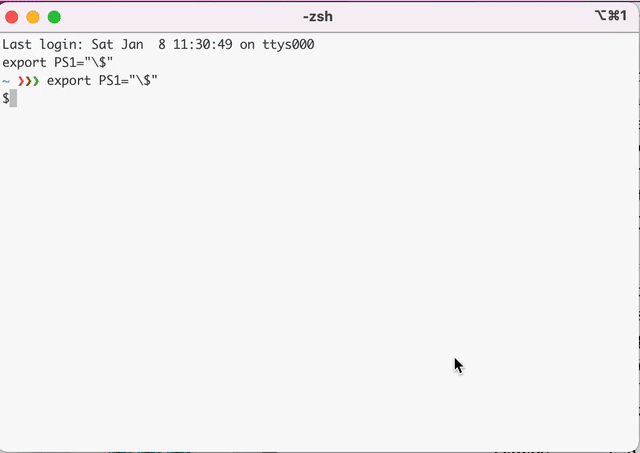

# OmniEdge Linux CLi

## Installing on Linux

OmniEdge Linux Cli is Compatible with linux for AMD64,Apple M1, Intel X86, ArmV7 and Arm64V8, Last update: Version 0.2.3, April, 25,2022

+ Sign up your account: [Sign up](https://omniedge.io/register)

+ Download and install omnidge cli by running the following command:

``` bash
curl https://omniedge.io/install/omniedge-install.sh | bash
```

+ Login By Password:

``` bash
omniedge login -u yourname@youremail.com -f your_auth_file_path
```
+ Login By Secret-Key, You can generate secret-key on omniedge web

```bash
omniedge login -s yoursecuritykey -f your_auth_file_path
```

+ Join Your Network,you can just call omniedge join, it will automatically prompt the available network for you to choose. And you can also add one parameter -n to specify the network id manually. And then, enjoy the omniedge network.

```bash
sudo omniedge join -f your_auth_file_path
```
and select your virtual network or

``` bash
sudo omniedge join -n 'virtual-network-id'
```
with a speicified virtual network.

+ Wait a second and a secure VPN will be established


## Run OmniEdge as a Service

+ After login in omniedge, run the command `omniedge join -f .omniedge/auth.json` to get your virutal network ID.

```bash
omniedge join -f .omniedge/auth.json

INFO[0000] You are in mode: prod
INFO[2022-01-17T11:34:28] List Virtual Network response
Use the arrow keys to navigate: ↓ ↑ → ←  and / toggles search
choose the network
  🌶 Home

--------- Virtual Network ----------
Name:        Home
Cidr:        100.100.0.0/24
Role:        2
ID:          your_virtual_network_id

```

+ Change the virtual network and your_auth_file_path in **omniedge.service**

```bash
[Unit]
Description=omniedge process
After=network-online.target syslog.target nfw.target
Wants=network-online.target

[Service]
Type=simple
ExecStartPre=
#Replace to your real virtual network id(can be found by run omniedge join) and auth.json path
ExecStart=/usr/local/bin/omniedge join -n "your_virtual_network_id" -f your_auth_file_path
Restart=on-abnormal
RestartSec=5

[Install]
WantedBy=multi-user.target
Alias=

```

+ Copy `omniedge.service`

```bash
cp linux/etc/systemd/system/omniedge.service /etc/systemd/system/
```

+ Activate `omniedge.service`

```bash
systemctl daemon-reload
systemctl enable omniedge.service
systemctl enable omniedge.service
```


## Release Notes

|Version|Release Date|Notes|
|--|--|--|
|0.2.3|April, 25, 2022|Add refresh token|
|0.2.2|February, 27,2022|Fix machine ID error|
|0.2.1|January, 15, 2022|Integrated with new backend|
|0.2.0 |August,2, 2021|Initial release , new backend API,Optimize workflow,Fix incorrect device mac block the OmniEdge start|
|0.1.0|Apr 8, 2021|Initial release|


-----

If you have more questions, feel free to [contact us](mailto:support@omniedge.io).